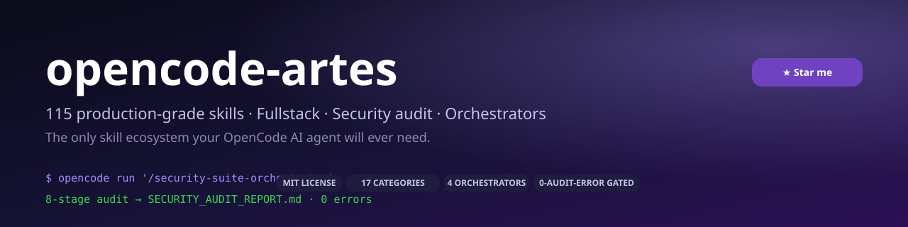
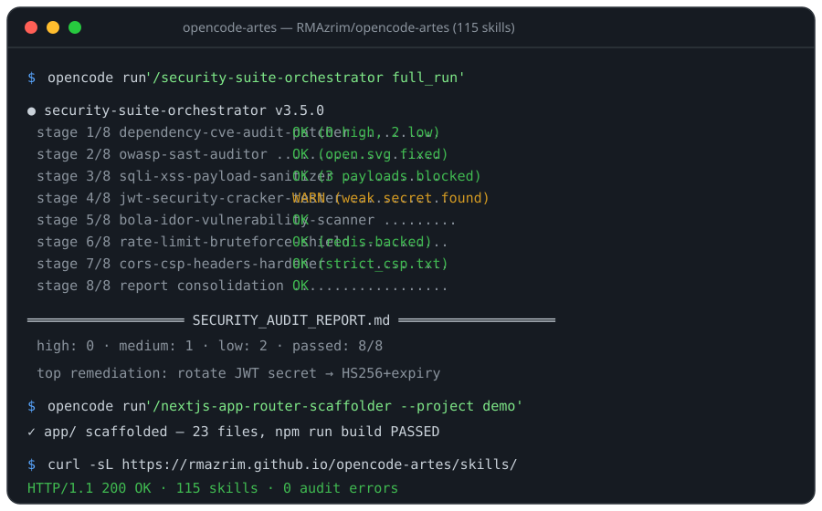

# opencode-artes 🚀

<div align="center">

  

  **The only skill ecosystem your OpenCode AI agent will ever need.**

  **115 production-grade skills · Fullstack web · Localhost security auditing · 4 suite orchestrators**

  [](https://github.com/RMAzrim/opencode-artes/stargazers)
  [](https://github.com/RMAzrim/opencode-artes/network)
  [](https://github.com/RMAzrim/opencode-artes/blob/main/registry.json)
  [](LICENSE)
  [](https://github.com/RMAzrim/opencode-artes/actions/workflows/verify.yml)
  [](https://github.com/RMAzrim/opencode-artes/commits/main)
  [](https://opencode.ai)

</div>

<p align="center">
  <a href="https://github.com/RMAzrim/opencode-artes/stargazers">⭐ Star the repo</a> ·
  <a href="https://github.com/RMAzrim/opencode-artes/discussions">💬 Discussions</a> ·
  <a href="https://rmazrim.github.io/opencode-artes/">🌐 Live catalog</a> ·
  <a href="#quick-start">⚡ Install</a> ·
  <a href="CONTRIBUTING.md">🤝 Contribute</a>
</p>

## ✨ Why opencode-artes?

One repository, **every skill** your OpenCode agent could ever need — from scaffolding a full Next.js stack to auditing its security like a pentester, and orchestrating the whole pipeline with one command.

- **115 production-grade skills** across 17 categories — frontend, backend, API, database, devops, testing, AI-ops, security auditing, and more.
- **Complete, runnable reference implementations** inside every skill (no filler, no placeholders) with explicit 5-part structure: architecture, data contracts, reference code, execution protocol, edge cases.
- **Zero-config discovery** — load as slash commands (`/security-suite-orchestrator`) and natural-language auto-triggers with zero extra configuration.
- **4 suite orchestrators** that chain the skills into one-command pipelines: security, frontend, backend, and infrastructure/QA.
- **Localhost-first security** — CVE audit, SAST, SQLi/XSS, JWT cracking, IDOR/BOLA, rate-limit, and header hardening all run against your *local* codebase and server.
- **Battle-tested structure** — canonical files in `skills/`, generated `.opencode/skills/`, audited with 0 errors.

## 🎬 See it in action

One command chains the whole security audit pipeline and writes a single report; a second one scaffolds a production Next.js app router:



## 🚀 Quick Start

### Option A — global install (recommended, 10 seconds)

Add one line to your OpenCode config (`~/.config/opencode/opencode.jsonc`), then restart OpenCode:

```jsonc
{
  "skills": ["https://rmazrim.github.io/opencode-artes/skills/"]
}
```

All 115 skills become available everywhere. (This HTTP-catalog URL serves the latest generated `.opencode/skills/` copies.)

### Option B — clone & build

```bash
git clone https://github.com/RMAzrim/opencode-artes.git
cd opencode-artes
npm install
npm run build    # regenerates registry.json + .opencode/skills (115 skills)
opencode run '<your request>' --dir .
```

> **Note:** OpenCode loads skills at startup — restart OpenCode after `npm run build` (or after pulling new versions) so new skills are picked up. No other configuration needed.

## 🗺️ What's inside — 115 skills across 17 categories

| Category | Skills | Representative skills |
|----------|:------:|------------------------|
| **ai-ops** | 6 | `prompt-evaluator`, `structured-output-enforcer`, `tool-schema-builder` |
| **algorithms** | 2 | `data-structure-optimizer`, `procedural-dungeon-generator` |
| **api** | 3 | `graphql-schema-designer`, `mcp-tools-auto-bridge`, `webhook-handler-generator` |
| **backend** | 16 | `express-fastapi-route-builder`, `auth-session-oauth2-scaffolder`, `middleware-order-validator` |
| **cloud** | 3 | `terraform-module-builder`, `k8s-manifest-validator`, `serverless-function-generator` |
| **core-coding** | 9 | `ast-anti-pattern-slayer`, `startup-cold-boot-optimizer`, `refactor-safety-harness` |
| **core-engine-hardening** | 11 | `cmd-sanitizer`, `memory-journal`, `verify-orchestrator` |
| **data-science** | 2 | `pandas-data-cleaner`, `chart-config-generator` |
| **database** | 7 | `drizzle-prisma-orm-architect`, `database-zero-downtime-migrator`, `schema-drift-detector` |
| **debugging** | 2 | `memory-leak-debugger`, `postmortem-autobiographer` |
| **developer-experience** | 13 | `pr-logic-reviewer`, `timezone-trap-cron-debugger`, `monorepo-package-cleaner` |
| **devops** | 5 | `dockerfile-builder`, `dependency-fitness-scorecard`, `performance-budget-bouncer` |
| **frontend** | 10 | `nextjs-app-router-scaffolder`, `tailwind-responsive-darkmode-styler`, `accessibility-auditor` |
| **orchestrator** | 7 | `security-suite-orchestrator`, `frontend-suite-orchestrator`, `infra-qa-suite-orchestrator` |
| **security** | 12 | `owasp-sast-auditor`, `trojan-source-hunter`, `license-clash-mediator` |
| **software-architecture** | 3 | `design-pattern-implementer`, `dependency-injection-wire` |
| **testing** | 4 | `unit-test-generator`, `flaky-test-jury`, `golden-snapshot-migrator` |

> The full 115-skill catalog with per-skill descriptions is in the [**Full Skill Catalog**](#-full-skill-catalog--function) section below.

## 📦 Repository structure

```
opencode-artes/
├── skills/<skill-id>/<skill-id>.md   # canonical, source-of-truth skill files
├── .opencode/skills/<id>/SKILL.md    # generated OpenCode-discoverable copies (npm run build)
├── registry.json                     # machine-readable catalog (id, path, category, tags, description)
├── scripts/                          # build, audit and GitHub-sync tooling
├── docs/                             # GitHub Pages catalog site (live catalog)
└── assets/                           # banners, screenshots, demos
```

Each skill file follows the exact same contract: `## 1. System Architecture & Prerequisites`, `## 2. Input/Output Data Contracts`, `## 3. Production Reference Implementation` (complete runnable code), `## 4. Execution Protocol & Step-by-Step Workflow`, `## 5. Edge Cases & Error Handling`.

---

## 🧩 Full Skill Catalog & Function

Every skill below is loadable via its folder-derived ID as a slash command
(`/<id>`), discoverable by natural language through its `description`, and has a
complete production reference implementation inside its document. Header row
per category shows the category-wide skill count for the **v3.5.0** release.

| Skill ID | Display name | What it does (description) |
|---|---|---|
| **ai-ops** (6) | | | |
| `agent-self-debugger-loop` | Agent Self-Debugger Loop | A Python CLI (self_debug.py) that parses pytest stderr/stdout tracebacks, extracts the failing File x.py line N location, reads and rewrites that file via an ast.NodeTransformer to inject sys._getframe()-based log probes and None/missing-attribute guards, re-runs pytest up to 4 attempts, and rolls back via git stash on exhaustion. Pure stdlib (ast, re, subprocess, tempfile, pathlib) plus pytest. |
| `context-compressor` | Context Compressor | Compress long conversation histories or documents to save context window token limits. |
| `prompt-evaluator` | Prompt Evaluator | Evaluate agent prompt effectiveness using accuracy metrics and token constraints. |
| `rag-chunking-evaluator` | RAG Chunking Evaluator | Analyze document structures to recommend optimal chunking strategies and overlap ratios for RAG pipelines. |
| `structured-output-enforcer` | Structured Output Enforcer | Convert unstructured LLM output into validated JSON adhering to strict Zod or JSON Schema rules. |
| `tool-schema-builder` | Tool Schema Builder | Convert standard code functions into JSON schema format for AI function calling. |
| **algorithms** (2) | | | |
| `data-structure-optimizer` | Data Structure Optimizer | Analyze algorithm time/space complexity (Big O) and refactor logic using optimal data structures (Heaps, Tries, Hash Maps). |
| `procedural-dungeon-generator` | Procedural Dungeon & Map Generator | Implements deterministic 2D tilemap generation with Binary Space Partitioning for rectangular rooms, A* grid pathfinding for corridor carving between room centers, and a Cellular Automata cave smoother using BFS connected-component flood-fill to keep a single reachable region, emitting a grid, ASCII map and JSON statistics. |
| **api** (3) | | | |
| `graphql-schema-designer` | GraphQL Schema Designer | Design GraphQL type definitions, query/mutation schemas, and resolver boilerplate code. |
| `mcp-tools-auto-bridge` | MCP Tools Auto Bridge | A Python generator (bridge_gen.py) that reads a target source file via ast reflection, extracts public function signatures (name, parameters, type annotations, docstrings, return types), and writes a standalone MCP server (mcp_server.py) using mcp.server.fastmcp.FastMCP with one @mcp.tool() per function and a stdio transport entry point. Stdlib-only generator; runtime requires mcp package. |
| `webhook-handler-generator` | Webhook Handler Generator | Draft secure webhook receiver endpoints complete with cryptographic signature verification (Stripe, GitHub, Midtrans). |
| **backend** (16) | | | |
| `auth-session-oauth2-scaffolder` | Auth Session & OAuth2 Scaffolder | Implements comprehensive user authentication systems supporting secure cookie sessions, JWT refresh token rotation, password hashing, and third-party OAuth2 social logins. |
| `caching-strategy-implementer` | Caching Strategy Implementer | Implement Cache-Aside, Write-Through, and TTL-based caching logic using Redis or in-memory LRU caches. |
| `docker-multi-stage-stack-builder` | Docker Multi-Stage Stack Builder | Containerizes web applications and dependencies into lightweight, production-ready multi-stage Docker images orchestrated via Docker Compose. |
| `express-fastapi-route-builder` | Express & FastAPI Route Builder | Generates enterprise-grade RESTful API routes in Node.js (Express) or Python (FastAPI) complete with payload validation, unified error handling, and automated Swagger specs. |
| `graphql-schema-dataloader-builder` | GraphQL Schema & DataLoader Builder | Designs performance-optimized GraphQL APIs with strict type definitions, clean Query/Mutation resolvers, and batching mechanisms to eliminate N+1 database queries. |
| `jwt-token-rotator` | JWT Token Rotator | Implement secure short-lived access token renewal and refresh token rotation with revocation blacklisting. |
| `pagination-cursor-builder` | Pagination Cursor Builder | Build cursor-based and keyset pagination handlers for database queries and API endpoints. |
| `playwright-e2e-security-flow-tester` | Playwright E2E Security Flow Tester | Crafts automated End-to-End (E2E) browser testing suites validating critical user journeys, edge cases, and client-side security boundary enforcement. |
| `rate-limiter-middleware` | Rate Limiter Middleware | Build API rate-limiting middleware using Token Bucket or Sliding Window algorithms. |
| `redis-pubsub-cache-manager` | Redis Pub/Sub & Cache Manager | Deploys high-performance caching strategies and distributed message pub/sub event buses to reduce database load and handle background processing. |
| `wasm-rust-compiler` | WebAssembly Rust Compiler | Surveys JS and Python sources for CPU-bound hot loops, then provides a complete wasm-bindgen Rust implementation, Cargo manifest, wasm-pack build scripts, and browser loader glue for porting the bottlenecks to WebAssembly. |
| `websocket-realtime-handler` | WebSocket Realtime Handler | Implement WebSocket connection lifecycles, ping/pong heartbeats, reconnect logic, and event broadcasting. |
| `websocket-realtime-secure-engine` | WebSocket Realtime Secure Engine | Scaffolds high-throughput, bidirectional real-time communication layers over WebSockets or Server-Sent Events (SSE) with robust reconnection and authentication controls. |
| `websocket-realtime-sync-engine` | WebSocket Realtime Sync Engine | Implements a dependency-light ESM WebSocket sync client with exponential-backoff reconnection, heartbeat ping/pong keep-alive, JSON Patch style delta application, and version-vector resync reconciliation, plus a runnable in-memory echo-server demo. |
| `error-code-consistency-auditor` | Error Code Consistency Auditor | Audit every error class, message, and HTTP mapping across the codebase for duplication, contradictory status codes, and undocumented errors. |
| `middleware-order-validator` | Middleware Order Validator | Audit middleware registration order in Express/FastAPI apps against safety rules — auth before authz, rate-limit before routes, error handlers last — and emit fixes. |
| **cloud** (3) | | | |
| `k8s-manifest-validator` | K8s Manifest Validator | Validate and lint Kubernetes manifest files (YAML/JSON) against required fields, resource constraints, and best practices, with an optional kubectl dry-run schema check. |
| `serverless-function-generator` | Serverless Function Generator | Scaffold lightweight serverless handlers for Cloudflare Workers or AWS Lambda with standard CORS and error handling. |
| `terraform-module-builder` | Terraform Module Builder | Draft modular, reusable Infrastructure-as-Code Terraform modules for cloud infrastructure. |
| **core-coding** (9) | | | |
| `ast-anti-pattern-slayer` | AST Anti-Pattern Slayer | Parses Python or JavaScript-style source into an AST, computes cyclomatic complexity v(G) as decision count plus one, maximum block nesting depth, bare except clauses and unreachable dead code, then uses a conservative ast.NodeTransformer to rewrite trailing if/else wrappers into semantics-preserving early return and continue guard clauses, emitting a structured JSON diagnostics report with file line and column locations. |
| `async-concurrency-handler` | Async Concurrency Handler | Implement async/await workflows, promise pools, worker threads, or goroutines while preventing race conditions. |
| `bytecode-decompiler-assistant` | Bytecode Decompiler & Obfuscation Assistant | Loads Python pyc bytecode via marshal after importlib header validation, pretty-prints raw dis, reconstructs a basic-block control-flow graph annotated with loop heads and try/except regions, renames mangled single-letter variables using usage heuristics, renders a readable structured pseudo-Python outline, flags obfuscation signatures such as missing strings, oversized constants and dynamic eval execution, and documents the uncompyle6 byte-exact pipeline when it is installable. |
| `chess-engine-mechanic-builder` | Custom Chess Engine Mechanic Builder | Wraps python-chess inside a SkillChessBoard that adds turn tracking, per-skill cooldown ticks, a Teleport mechanic and a Freeze Square mechanic with expiry timers, plus rotate_view_180 coordinate mapping, a pygame-free ASCII renderer and an optional pygame renderer, all driven by a runnable demo. |
| `error-class-hierarchy-builder` | Error Class Hierarchy Builder | Create domain-specific custom exception classes with standardized error codes, HTTP statuses, and metadata payloads. |
| `regex-builder-parser` | Regex Builder & Parser | Construct ReDoS-safe regular expressions and string parser logic for complex input string extraction. |
| `type-definition-generator` | Type Definition Generator | Convert untyped JavaScript, Python dicts, or raw JSON payloads into strict TypeScript interfaces or Type Hint annotations. |
| `refactor-safety-harness` | Refactor Safety Harness | Record golden outputs of current behavior before a refactor, then diff outputs after to prove behavior is unchanged. |
| `startup-cold-boot-optimizer` | Startup Cold-Boot Optimizer | Profile application cold-start, identify heavy imports and work in the boot hot path, and produce a targeted lazy-load optimization plan plus proven timings. |
| **core-engine-hardening** (11) | | | |
| `cmd-sanitizer` | Cmd Sanitizer | Static linter over command strings before execution. Detects and rewrites unsafe Win32/PowerShell 5.1 patterns: bare && chaining, unquoted spaced paths, $? vs $LASTEXITCODE confusion, UTF-16 pipe corruption, and timeout-kill indeterminacy. Emits sanitized command + guard boilerplate. |
| `context-bank` | Context Bank | Materializes a structured CONTEXT_BANK.md + JSON file that captures verified file paths, decided invariants, active TODOs, and open risks, allowing subagents and repeated sessions to reload a lean current snapshot instead of decaying transcript memory. |
| `deptomap` | Dep Map | Builds a persistent dependency graph (`dep-graph.json`) by scanning `import`/`require`/`include` patterns across the codebase. Before any edit it lists the blast radius of consumers for the target symbol; after the edit it re-verifies no orphaned references exist. |
| `memory-journal` | Memory Journal | Cross-session ledger at `~/.opencode/memory/*.md`: appends decisions/rejections/root-causes during a session; on session start, diffs against the live transcript so the agent stops re-litigating settled decisions. |
| `memory-leak-profiler-debugger` | Memory Leak Profiler & Debugger | Instruments a target callable under tracemalloc and the cyclic garbage collector, takes paired allocation snapshots across repeated runs, flags allocations whose cumulative bytes keep growing across iterations with a repeating traceback as leak signatures, counts live objects per type, verifies weak-reference lifetimes, and reports circular-reference clusters via gc.get_referrers, emitting a structured JSON LeakReport of LeakCandidate entries and documented Node.js v8 heap-snapshot equivalents. |
| `output-trust-check` | Output Trust Check | Wraps every truncating tool call: when output is truncated/byte-capped, refuses to decide on the truncated portion and automatically requests the tail window or a targeted grep. Flags encoding anomalies (UTF-16 NULs, BOMs) as suspect. |
| `regression-sentinel` | Regression Sentinel | Before each new task in a long session, re-runs the last N passing checkpoints captured by verify-orchestrator as a smoke suite, catching regressions caused by recent edits before they compound. |
| `schema-sync` | Schema Sync | Before multi-step toolkit workflows, pings the live tool (via schema-style endpoints / search tools) and diffs against my cached schema; on mismatch, rewrites the workflow plan, never the cached assumptions silently. |
| `spec-loop-closer` | Spec Loop Closer | Forces every user requirement through a 1:1 mapping to a checkable assertion (grep-able token, executable test, or numeric threshold) before implementation begins. Blocks "done" until each assertion has a machine-runnable check. |
| `subagent-evidence` | Subagent Evidence | Dispatch-time contract for explore agents: return only observations each with a `file:line` citation and raw excerpt; inference must be explicitly tagged `[INFERRED]`. Post-dispatch, I sample-cite — verify ≥2 citations per summary myself before trusting conclusions. |
| `verify-orchestrator` | Verify Orchestrator | Auto-discovers project verification surface (test/lint/typecheck configs), runs the minimal verification suite, and gates every completion claim on machine-parsed exit codes and assertion output. Returns UNVERIFIED rather than silent on discovery failure. |
| **data-science** (2) | | | |
| `chart-config-generator` | Chart Config Generator | Map raw JSON datasets into ready-to-use chart configuration objects (Chart.js, Recharts, or ECharts). |
| `pandas-data-cleaner` | Pandas Data Cleaner | Generate Python Pandas scripts to handle missing values, drop duplicates, and normalize column data types. |
| **database** (7) | | | |
| `database-zero-downtime-migrator` | Database Zero-Downtime Migrator | Generates Expand-and-Contract (Parallel Change) migration SQL as four ordered stage files plus a JSON manifest from a MigrationPlan, emitting Postgres or MySQL dialect output through a Python stdlib argparse module. |
| `db-migration-generator` | DB Migration Generator | Generate database schema migration scripts (Prisma/TypeORM/Alembic) based on model changes. |
| `drizzle-prisma-orm-architect` | Drizzle & Prisma ORM Architect | Architect relational database schemas, model complex entity relationships, optimize query execution, and generate zero-downtime database migration files. |
| `sql-query-optimizer` | SQL Query Optimizer | Analyze slow SQL queries, recommend indexes, and restructure join clauses. |
| `vector-db-hybrid-indexer` | Vector DB Hybrid Search Indexer | A dependency-light Python module (hybrid_index.py) implementing a self-contained BM25 sparse scorer, a cosine-similarity dense index with optional numpy and pure-math fallback, Reciprocal Rank Fusion (RRF, k=60) merging, and a Cross-Encoder-style re-ranker via embedding dot products (drop-in replaceable by sentence-transformers). Functions index_documents(docs), search(query, top_k), rrf(rankings, k=60), plus a main() demo over a built-in corpus. |
| `vector-db-indexer` | Vector DB Indexer | Chunk documents and store vector embeddings into a Vector DB. |
| `schema-drift-detector` | Schema Drift Detector | Compare SQL migrations, ORM models, and TypeScript types against one another to find which layer is silently out of sync before your queries start breaking. |
| **debugging** (2) | | | |
| `memory-leak-debugger` | Memory Leak Debugger | Identify and resolve unmanaged memory leaks, event listener leaks, and circular references across runtimes. |
| `postmortem-autobiographer` | Postmortem Autobiographer | Turn an incident description or production stack trace into a structured postmortem with timeline, 5-whys, and trackable action items — ready for team review. |
| **developer-experience** (13) | | | |
| `changelog-generator` | Changelog Generator | Parse Git commit logs to generate a CHANGELOG.md adhering to Conventional Commits. |
| `cli-tool-scaffolder` | CLI Tool Scaffolder | Scaffold interactive command-line interface tools with argument parsing, flags, spinners, and help menus. |
| `code-translator` | Code Translator | Precisely convert code logic from one programming language to another. |
| `cron-schedule-parser` | Cron Schedule Parser | Translate natural language time rules into valid 5-part or 6-part Cron schedule expressions. |
| `git-bisect-time-traveler` | Git Bisect Time Traveler | Automates regression tracking by orchestrating non-interactive git bisect sessions wrapped around a headless test harness, parses the first-bad-commit SHA, subject and date plus the number of commits examined, and generates a minimal git-apply-compatible revert patch for exactly the files the offending commit touched, with optional dry-run verification. |
| `tui-app-scaffolder` | Interactive TUI Application Scaffolder | Scaffolds a complete reactive Textual terminal Todo application with header, input, DataTable, footer, status label, custom keybindings and CRUD handlers, and includes a fully written Go Bubbletea counter alternative. |
| `mermaid-diagrammer` | Mermaid Diagrammer | Convert code logic, database structures, or system architectures into valid Mermaid.js visual diagrams. |
| `openapi-spec-writer` | OpenAPI Spec Writer | Extract backend API code into OpenAPI/Swagger 3.0 documentation. |
| `regex-builder-explainer` | Regex Builder & Explainer | Construct complex regular expressions based on pattern requirements with step-by-step logic breakdown. |
| `env-config-sleuth` | Env Config Sleuth | Cross-reference environment variables referenced by code against definitions in .env files, CI workflows, and docs to find missing, misspelled, and orphaned configuration keys. |
| `monorepo-package-cleaner` | Monorepo Package Cleaner | Audit a monorepo workspace for dependency cycles, mismatched shared versions, and cross-boundary imports, then emit a prioritized cleanup plan. |
| `pr-logic-reviewer` | PR Logic Reviewer | Review a pull-request diff for logic bugs — boundary conditions, null safety, state and edge semantics — not style, and emit a bug-first review report. |
| `timezone-trap-cron-debugger` | Timezone-Trap Cron Debugger | Simulate thousands of scheduled job runs across timezones and DST transitions to provably detect misfires, skips, and duplicate executions hidden in cron schedules. |
| **devops** (5) | | | |
| `dockerfile-builder` | Dockerfile Builder | Draft efficient, secure, and minimal multi-stage Dockerfiles. |
| `github-actions-generator` | GitHub Actions Generator | Design automated CI/CD workflows for testing, building, and deployment. |
| `codegen-drift-watchdog` | Codegen Drift Watchdog | Detect when generated output (Prisma client, tRPC router types, OpenAPI clients) is stale versus its source schema, then auto-regenerate or fail CI with a precise list. |
| `dependency-fitness-scorecard` | Dependency Fitness Scorecard | Score every third-party dependency on maintenance activity, release cadence, issue health, and size so upgrade decisions are data-driven instead of fear-driven. |
| `performance-budget-bouncer` | Performance Budget Bouncer | Enforce performance budgets in CI and reject pull requests that exceed size, weight, or timing thresholds with a machine-readable flagging report. |
| **frontend** (10) | | | |
| `accessibility-auditor` | Accessibility Auditor | Audit HTML/JSX code against WCAG 2.1 guidelines and provide accessible ARIA code fixes. |
| `form-validation-schema-builder` | Form Validation & Schema Builder | Builds robust, type-safe interactive web forms featuring complex validation logic, real-time error feedback, and seamless client-server schema synchronization. |
| `i18n-locale-extractor` | i18n Locale Extractor | Extract hardcoded UI text strings into structured internationalization JSON translation files. |
| `lighthouse-web-vitals-optimizer` | Lighthouse & Web Vitals Optimizer | Audits web performance metrics, optimizes client-side bundle footprints, and refactors resource delivery to achieve maximum Core Web Vitals scores. |
| `nextjs-app-router-scaffolder` | Next.js App Router Scaffolder | Automatically scaffolds production-ready Next.js App Router directory structures, isolating React Server Components (RSC) from Client Components, configuring standardized layout boundaries, error handlers, and loading states. |
| `seo-metadata-builder` | SEO & Metadata Builder | Generate complete HTML meta tags, Open Graph, Twitter Cards, and JSON-LD structured data. |
| `state-management-query-architect` | State Management & Query Architect | Establishes a clean separation between global client UI state and asynchronous server state management using Zustand and TanStack Query (React Query). |
| `state-management-architect` | State Management Architect | Implement clean application state management patterns (Zustand, Redux Toolkit, Pinia) with atomic state updates. |
| `tailwind-converter` | Tailwind CSS Converter | Convert raw CSS or inline styles into clean, idiomatic Tailwind CSS utility classes. |
| `tailwind-responsive-darkmode-styler` | Tailwind Responsive & Darkmode Styler | Transforms raw JSX or HTML structures into fully responsive, accessible, dark-mode ready web interfaces using Tailwind CSS utility classes. |
| **orchestrator** (7) | | | |
| `backend-suite-orchestrator` | Backend Suite Orchestrator | Orchestrates the 4-stage backend build chain — REST routes with OpenAPI spec (skills/express-fastapi-route-builder), auth/session/OAuth2 (skills/auth-session-oauth2-scaffolder), GraphQL schema plus per-request DataLoaders (skills/graphql-schema-dataloader-builder), and JWT-guarded realtime WebSockets (skills/websocket-realtime-secure-engine) — followed by route-integrity, middleware-registration, build, smoke-test, and API-spec validation. Accepts full_run, include_steps, and skip_steps parameters to execute only a selected chain subset, applies predecessor gating and fail_fast semantics, captures per-step stdout and reports, and consolidates everything into a single BACKEND_SUITE_REPORT.md with aggregate counts, per-step pass/fail status, and recommendations. |
| `frontend-suite-orchestrator` | Frontend Suite Orchestrator | Orchestrates a 5-stage frontend build chain over a Next.js project: App Router scaffold, Tailwind responsive/dark-mode styling, zod-backed progressive forms, and the Zustand + TanStack Query state/query pipeline, followed by a build validation gate that runs `npm run build` / `next build`, verifies the component tree and routes exist, and consolidates everything into a FRONTEND_SUITE_REPORT.md. Supports full_run, include_steps, skip_steps, fail_fast, and artifact_dir customization so teams can re-materialize any subset of the scaffolding chain. The final report captures the scaffolded file-tree summary, the validation build exit code, and open items for follow-up. |
| `infra-qa-suite-orchestrator` | Infrastructure & QA Suite Orchestrator | Orchestrates the 5-stage infrastructure and QA chain — ORM schemas plus zero-downtime migrations (skills/drizzle-prisma-orm-architect), Redis caching and pub/sub event bus (skills/redis-pubsub-cache-manager), multi-stage Docker images with Compose stack (skills/docker-multi-stage-stack-builder), Playwright E2E and security flows (skills/playwright-e2e-security-flow-tester), and Lighthouse Core Web Vitals audits (skills/lighthouse-web-vitals-optimizer) — all executed against the provisioned stack. Accepts full_run, include_steps, and skip_steps parameters to select the chain subset, applies predecessor gating and fail_fast semantics, captures per-step stdout and reports, and consolidates DB migration status, cache health, docker build/health, E2E pass counts, a Lighthouse scores table, and recommendations into a single INFRA_QA_SUITE_REPORT.md. |
| `looping-auto-fixer` | Looping Auto Fixer | Iterative fixer that runs unit-test-generator → validates via skill-tester → if tests fail, feeds error logs to memory-leak-debugger or patches code → repeats up to 3 retry iterations → exits on SUCCESS or halts on FAILED_AFTER_MAX_RETRIES. |
| `mega-pipeline-deployer` | Mega Pipeline Deployer | Flexible orchestration engine that executes pipeline workflows in Full Mode (all 7 steps sequentially) or Selective Mode (user-specified step subset). Performs data contracting and validation between active steps, skips inactive steps gracefully without breaking the chain, and halts execution with exact error logging when an active step fails. |
| `project-auto-builder` | Project Auto Builder | Dynamic orchestrator that inspects ./registry.json, analyzes the project workspace stack (Node.js, Python, Docker, etc.), automatically matches and orders optimal skills into an execution sequence, runs the selected skills, and generates a final readiness summary report. |
| `security-suite-orchestrator` | Security Suite Orchestrator | Orchestrates a full 8-stage security audit chain over a local web app: dependency CVE scan, OWASP SAST static audit, SQLi/XSS input sanitization, JWT security cracking, BOLA/IDOR authorization scan, rate-limit brute-force shielding, and CORS/CSP header hardening, then consolidates every per-stage report into one SECURITY_AUDIT_REPORT.md. Supports full_run, include_steps, skip_steps, fail_fast, and report_dir customization so operators can re-run a subset of the chain without touching the others. Aggregates severity counts per category, per-stage pass/fail status, and a top-remediation ranked list from all seven stage artifacts. |
| **security** (12) | | | |
| `bola-idor-vulnerability-scanner` | BOLA / IDOR Vulnerability Scanner | Inspects API endpoints for Broken Object Level Authorization (BOLA/IDOR) flaws to ensure users cannot manipulate resource IDs to access foreign data. |
| `cors-csp-headers-hardener` | CORS & CSP Headers Hardener | Inspects HTTP response headers on local web servers and injects defensive security headers to prevent clickjacking, cross-site scripting, and unauthorized domain access. |
| `dependency-cve-audit-patcher` | Dependency CVE Audit & Patcher | Audits third-party open-source packages for known vulnerabilities (CVEs), evaluating breaking change risks and generating automated patch updates. |
| `jwt-security-cracker-tester` | JWT Security & Algorithm Cracker Tester | Evaluates JSON Web Token handling on local API routes to identify token forgery, algorithm confusion, and weak signature secrets. |
| `owasp-sast-auditor` | OWASP SAST Security Auditor | Audits local web application source code for OWASP Top 10 vulnerabilities, generating security report logs and applying immediate automated code fixes. |
| `owasp-vulnerability-checker` | OWASP Vulnerability Checker | Audit API endpoints for common security vulnerabilities (XSS, SQLi, CSRF). |
| `prompt-injection-shield` | Prompt Injection & Security Shield | A stdlib-only Python module (shield.py) implementing InjectionShield static inspection for jailbreak signatures, system-prompt extraction patterns, and command-injection payloads across input strings and RAG context windows, plus deterministic canary-token injection and verification (the f(n) model-output challenge). Classes ShieldConfig, InjectionShield, ScanReport, and a scan_cli() argparse entry point that reads files/stdin and emits a JSON report. |
| `rate-limit-bruteforce-shield` | Rate-Limit & Brute-Force Shield | Scans sensitive authentication endpoints and implements Redis-backed rate-limiting controls to block credential stuffing and brute-force attacks. |
| `secrets-leak-detector` | Secrets Leak Detector | Scan codebases to detect leaked API keys, tokens, or credentials. |
| `sqli-xss-payload-sanitizer` | SQLi & XSS Payload Sanitizer | Identifies unescaped user inputs and unparameterized database queries, injecting sanitization middleware and parameterized bindings to neutralize XSS and SQLi. |
| `license-clash-mediator` | License Clash Mediator | Build a dependency-license graph and flag copyleft/permissive conflicts plus missing license metadata before they become legal incidents. |
| `trojan-source-hunter` | Trojan Source Hunter | Scan source files for invisible Unicode/Bidirectional trojan-source characters that silently alter code logic flow without being visible to reviewers. |
| **software-architecture** (3) | | | |
| `dependency-injection-wire` | Dependency Injection Wiring | Decouple code modules using Inversion of Control (IoC) containers and explicit interface abstractions. |
| `design-pattern-implementer` | Design Pattern Implementer | Refactor code to apply object-oriented design patterns (Factory, Strategy, Observer, Decorator, Adapter) cleanly. |
| `pygame-state-machine-architect` | Pygame State Machine Architect | Defines an abstract BaseState lifecycle (startup, cleanup, get_event, update, draw) plus a StateMachine manager running a fixed delta-time loop with dt = clock.tick(60) / 1000.0, providing concrete MenuState, GameplayState, and PauseState implementations and a SpriteSheetSlicer that parses TexturePacker XML or JSON atlases into pygame.Surface subsurface frames. |
| **testing** (4) | | | |
| `unit-test-generator` | Unit Test Generator | Generate automated unit test suites (Jest, Pytest, Go test) with complete mocking. |
| `flaky-test-jury` | Flaky Test Jury | Analyze repeated CI test logs, classify flaky tests by root-cause category, and emit stabilization patches plus a verdict report before they erode team trust. |
| `golden-snapshot-migrator` | Golden Snapshot Migrator | Capture golden snapshots before a major library or dependency migration and diff after to keep the external behavior contract intact. |
| `shadow-traffic-replayer` | Shadow Traffic Replayer | Replay recorded production HTTP traffic against a new build and diff responses to surface API regressions without writing a single test. |


## 🔧 Available Scripts

| Script | Description |
|--------|-------------|
| `npm run build` | Regenerates `registry.json` and `syncs .opencode/skills/<id>/SKILL.md` by scanning `./skills/*/*.md` |
| `npm run sync-skills` | Alias of `npm run build` – regenerates the OpenCode `.opencode/skills/` copies |
| `npm run pages` | Copies the generated skills into `docs/skills/` for the GitHub Pages live catalog |
| `npm run ci` | Runs build + the `scripts/ci-verify.js` contract check (used by GitHub Actions) |
| `npm run update-description` | Reads the skill count from `registry.json` and writes it into the GitHub repository description via `gh repo edit` (run after every `npm run build`) |
| `npm test` | Runs build and confirms registry generation |

## 🤝 Contributing

See [CONTRIBUTING.md](CONTRIBUTING.md) for detailed contribution guidelines, including the mandatory pre‑PR QC step for every skill file. Every PR is gated by the [`verify`](.github/workflows/verify.yml) CI workflow.

Community docs & templates: [SECURITY.md](SECURITY.md) · [CODE_OF_CONDUCT.md](CODE_OF_CONDUCT.md) · [CHANGELOG.md](CHANGELOG.md) · [💬 Discussions](https://github.com/RMAzrim/opencode-artes/discussions) · [🐛 Bug report](.github/ISSUE_TEMPLATE/bug_report.md) · [✨ Feature request](.github/ISSUE_TEMPLATE/feature_request.md)

## ⭐ Support & share

If this repository helps you ship faster or builds something you are proud of, give it a ⭐ — it is the single biggest boost for discoverability. Share the live catalog: **https://rmazrim.github.io/opencode-artes/**

Ready-to-post promo copy (X/Twitter, LinkedIn, Reddit, dev.to) lives in [docs/PROMO.md](docs/PROMO.md).

## 🙏 Acknowledgments

Built with ❤️ for the OpenCode agent community.